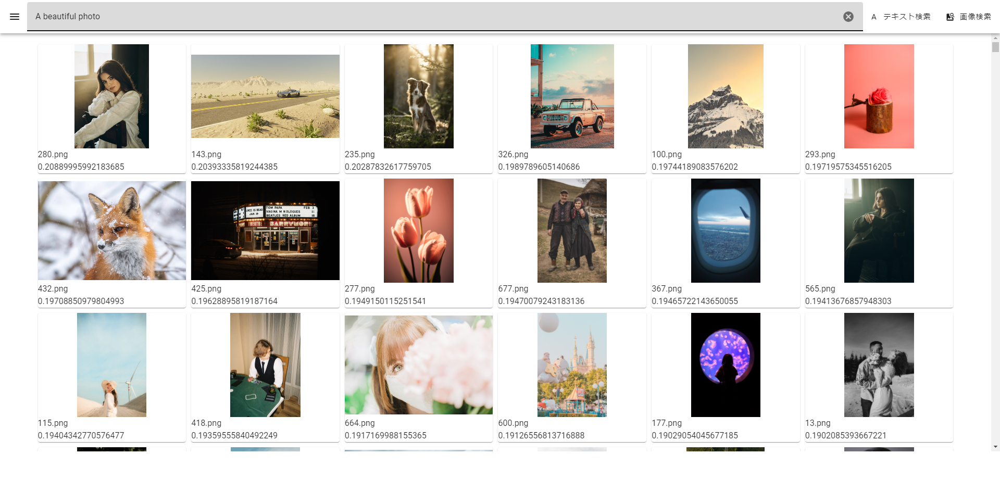

# MyImageSearch

MyImageSearch は、OpenAI の [CLIP](https://openai.com/index/clip/) (Contrastive Language-Image Pre-Training) モデルに基づいて、テキストクエリを使用してローカルマシン上の画像を検索し、画像を見つけることができるWebアプリケーションです。



## Backend
画像を[openCLIP](https://github.com/mlfoundations/open_clip)を用いてembeddingsに変換し、SQLiteデータベースで管理している。検索には[faiss](https://github.com/facebookresearch/faiss)を使用して"index"を作成し、高速なベクトル検索を行っている。ウェブアプリケーションの実装には [Flask](https://flask.palletsprojects.com/en/3.0.x/)フレームワークを使用した。

## Frontend
アプリケーションのフロントエンドは、人気のマテリアルデザインコンポーネントフレームワークである[Vue.js](https://vuejs.org/)と[Vuetify](https://vuetifyjs.com/en/)を使用して開発した。

## Technologies
このプロジェクトで使用される主な言語は、Python、JavaScript、HTML です。

# Setup
次の手順に従って、win マシンで MyImageSearch をセットアップして実行します。
## 仮想環境を作成:
```
python -m venv venv
```
## 仮想環境を有効化:
```
venv\Scripts\activate      # Windows の場合
# または
source venv/bin/activate   # Linux/macOS の場合
```

## 依存ライブラリをインストール:
```
pip install torch torchvision torchaudio --index-url https://download.pytorch.org/whl/cu117
pip install faiss-cpu pandas Flask open_clip_torch
```
## Run the application:
```
python app.py
```
## Access UI:
[localhost](http://localhost)にブラウザからアクセスします。

# TODO
- 動作のステータス表示する
- CoCa model
