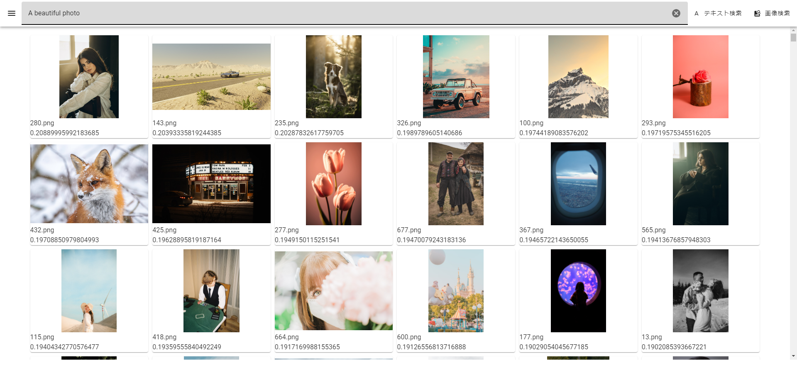

# MyImageSearch

MyImageSearch は、OpenAI の [CLIP](https://openai.com/index/clip/) (Contrastive Language-Image Pre-Training) モデルに基づいて、テキストクエリを使用してローカルマシン上の画像を検索し、画像を見つけることができるWebアプリケーションです。



## Backend
画像を[openCLIP](https://github.com/mlfoundations/open_clip)を用いてembeddingsに変換し、SQLiteデータベースで管理している。検索には[faiss](https://github.com/facebookresearch/faiss)を使用して"index"を作成し、高速なベクトル検索を行っている。ウェブアプリケーションの実装には [Flask](https://flask.palletsprojects.com/en/3.0.x/)フレームワークを使用した。

## Frontend
アプリケーションのフロントエンドは、人気のマテリアルデザインコンポーネントフレームワークである[Vue.js](https://vuejs.org/)と[Vuetify](https://vuetifyjs.com/en/)を使用して開発した。

## Technologies
このプロジェクトで使用される主な言語は、Python、JavaScript、HTML です。

# Setup
次の手順に従って、MyImageSearch をセットアップして実行します。

---

## 方法 1: uv を使ったセットアップ（推奨）

### 仮想環境を作成して有効化:
```
uv venv
.venv\Scripts\activate      # Windows の場合
# または
source .venv/bin/activate   # Linux/macOS の場合
```

### 依存ライブラリをインストール:
pyproject.tomlからインストール
```
uv sync
```

### アプリケーションを起動:
```
python app.py
```

---

## 方法 2: pip を使ったセットアップ

### 仮想環境を作成:
```
python -m venv venv
```

### 仮想環境を有効化:
```
venv\Scripts\activate      # Windows の場合
# または
source venv/bin/activate   # Linux/macOS の場合
```

### 依存ライブラリをインストール:
```
pip install torch torchvision torchaudio --index-url https://download.pytorch.org/whl/cu117
pip install faiss-cpu pandas Flask open_clip_torch
```

### アプリケーションを起動:
```
python app.py
```
## Access UI:
[localhost](http://localhost)にブラウザからアクセスします。

## Qwen3-VL-Embedding via vLLM

`--search_backend qwen_vl` は、クライアント側で Qwen3-VL-Embedding の重みをロードせず、WSL など別環境で起動した vLLM の OpenAI 互換 API (`POST /v1/embeddings`) に画像・テキストを送信します。MyImageSearch 側では画像読み込み、タグ付け、SQLite 保存、FAISS インデックス作成のみを行い、Qwen の画像前処理と GPU 推論は vLLM サーバー側で実行されます。

### WSL 側: vLLM 用の独立環境

MyImageSearch の仮想環境とは別に、WSL 側で vLLM 専用環境を作成します。

```bash
mkdir -p ~/qwen-vllm
cd ~/qwen-vllm

uv venv --python 3.12
source .venv/bin/activate

uv pip install "vllm>=0.14.0" --torch-backend=auto
```

標準解像度の起動例:

```bash
vllm serve Qwen/Qwen3-VL-Embedding-2B \
  --served-model-name Qwen/Qwen3-VL-Embedding-2B \
  --runner pooling \
  --host 0.0.0.0 \
  --port 8000 \
  --dtype float16 \
  --max-model-len 8192 \
  --gpu-memory-utilization 0.90 \
  --limit-mm-per-prompt '{"image":1,"video":0}' \
  --mm-processor-kwargs '{"min_pixels":4096,"max_pixels":262144}'
```

高解像度設定の起動例:

```bash
vllm serve Qwen/Qwen3-VL-Embedding-2B \
  --served-model-name Qwen/Qwen3-VL-Embedding-2B \
  --runner pooling \
  --host 0.0.0.0 \
  --port 8000 \
  --dtype float16 \
  --max-model-len 8192 \
  --gpu-memory-utilization 0.90 \
  --limit-mm-per-prompt '{"image":1,"video":0}' \
  --mm-processor-kwargs '{"min_pixels":4096,"max_pixels":1310720}'
```

`min_pixels` / `max_pixels` は `create_index.py` のクライアント引数では変更できません。vLLM 起動時の `--mm-processor-kwargs` で決まります。後方互換用の `--qwen-max-pixels` は API バックエンドでは無視され、指定時に警告を表示します。

サーバー起動後、モデル一覧を確認します。

```bash
curl http://127.0.0.1:8000/v1/models
```

### クライアント側: create_index.py の実行例

```bash
uv sync

uv run python create_index.py \
  --search_backend qwen_vl \
  --search_model_id Qwen/Qwen3-VL-Embedding-2B \
  --search_model_out_dim 2048 \
  --qwen-api-base http://127.0.0.1:8000/v1 \
  --batch_size 8 \
  --qwen-api-concurrency 8 \
  --disable-clip-metadata \
  --image_dir ./images \
  --meta_dir ./clip_meta
```

環境変数を使う Windows PowerShell の例:

```powershell
$env:VLLM_API_BASE = "http://127.0.0.1:8000/v1"
$env:VLLM_API_KEY = "EMPTY"

uv run python create_index.py `
  --search_backend qwen_vl `
  --batch_size 8 `
  --qwen-api-concurrency 8 `
  --disable-clip-metadata
```

`--qwen-api-base` は `/v1` なしでも指定できます。その場合は自動的に `/v1` が追加されます。WSL と Windows 間で `localhost` 転送が利用できない環境では、WSL の IP アドレスを `--qwen-api-base` に指定してください。

実画像での最終確認では、1〜数枚のテストディレクトリに対して `create_index.py` を実行し、Windows 側プロセスで Qwen モデルがロードされないこと、WSL 側 vLLM にリクエストが到達すること、埋め込み shape が `(N, 2048)` になること、L2 norm がほぼ 1 になること、SQLite へ 2048 次元 `float32` として保存されること、FAISS インデックス生成が成功すること、2 回目の実行で保存済み画像が再推論されないことを確認してください。
