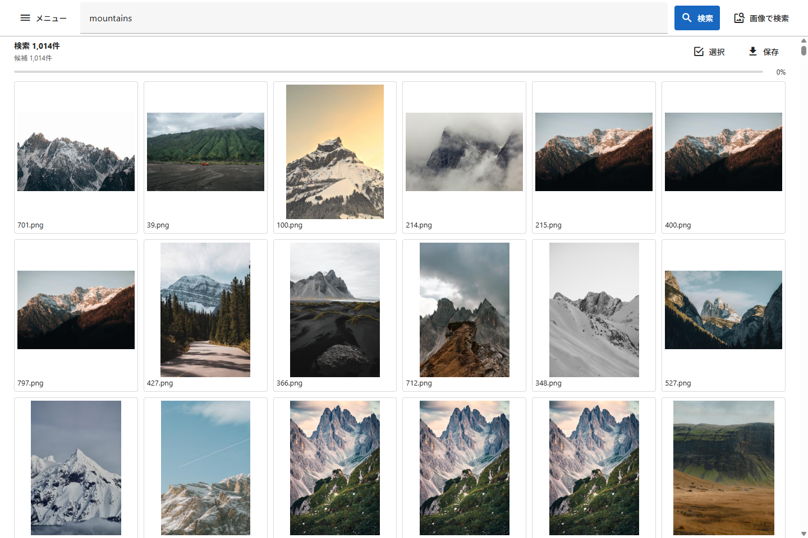
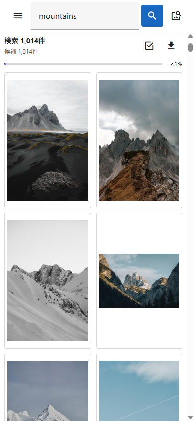

# MyImageSearch

ローカルに保存した画像を、言葉や似ている画像から探すWebアプリです。OpenCLIPによる画像・テキストの埋め込みとFAISSを使って検索し、ブラウザで閲覧・選択・保存できます。



プロジェクト内の軽量データを使った実際の検索画面です。スマホ幅でも、検索と画像の閲覧を同じ画面で続けられます。



## できること

- テキスト・画像・ファイル名・タグによる検索、ランダム表示、検索クエリの保存と再実行。
- 無限スクロールでの閲覧。件数の下のバーとパーセントで現在位置を確認でき、メニューから先頭へ戻れます。
- 画像の拡大、複数選択、最大1,024枚のZIP保存。
- 日本語・英語のUI切替、スマホ・タブレット・PCでの利用。

## セットアップ

Python 3.12以上と[uv](https://docs.astral.sh/uv/)を使用します。リポジトリのルートで実行してください。

```powershell
uv sync
```

現在の依存設定はPyTorchのCUDA版を参照しています。CUDAの版と取得先は `pyproject.toml` で確認し、別の実行環境では環境に合わせて調整してください。初回は検索モデルのダウンロードが発生します。

### 1. 画像とインデックスを用意する

**画像・生成済みDB・FAISSインデックス・モデル重みは同梱していません。** 自分の画像を `images/` に配置してください。既に対応する `clip_meta/` がある場合は、作成を省略して起動できます。

軽量な動作確認では、32枚以上の画像を配置し、次のコマンドで検索用インデックスを作成します。

```powershell
uv run python create_index.py --image_dir ./images --meta_dir ./clip_meta --search_backend open_clip --search_model_out_dim 768 --disable-clip-metadata --use-existing-tags --nlist 1 --bits_per_code 4 --batch_size 8 --num_workers 0
```

この例は検索に必要な埋め込みだけを作成し、追加の審美性・スタイル推論と自動タグ付けを省略します。既存のタグファイルがなければタグは空、画像区分は未分類になります。作成後は `clip_meta/ViT-L-14-openai/` にDBとインデックスが保存されます。

既存タグを使う場合は、画像の隣に `photo.jpg.tags.json` のように配置します。形式は `{"rating":"general","tags":["mountain","sky"]}` です。

`--nlist 1 --bits_per_code 4` は少数画像の確認用設定です。大規模データの作成ではこの2引数を外し、必要なメモリと検索精度を確認して調整してください。追加のメタデータ推論を有効にする場合は、`--aesthetic_model_path` で指定する重みなどを別途用意します。引数一覧は `uv run python create_index.py --help` で確認できます。

### 2. 起動する

```powershell
uv run python app.py --local --host 127.0.0.1 --port 5000
```

コンソールに「起動準備完了」と表示されたら、[http://127.0.0.1:5000](http://127.0.0.1:5000)を開きます。起動時にモデル・インデックス・件数を準備するため、大規模データでは接続を受け付けるまで時間がかかります。

タグなしで登録した画像は「未分類・評価なし」に含まれます。画像区分を絞って見つからなくなった場合は、メニューでこの区分を有効にしてください。

`--local` はプロジェクト内の `images/` と `clip_meta/` を使用します。データを更新した場合はアプリを再起動してください。`--skip-warmup` はUIなどの検証時に準備を省略するためのオプションです。

### 別の保存先・LANからの利用

```powershell
uv run python app.py --image-dir "D:/photos" --meta-dir "D:/image-index" --host 0.0.0.0 --port 5000
```

LAN内の端末では `http://<サーバーPCのIPアドレス>:5000/` を開きます。`0.0.0.0` は待受用の指定です。アプリに認証機能はないため、画像を共有してよいネットワーク内で使用してください。

保存先を毎回入力したくない場合は [.env.example](.env.example) を `.env` にコピーして編集し、次のように読み込みます。

```powershell
uv run --env-file .env python app.py --host 127.0.0.1 --port 5000
```

保存先の優先順位は、明示した `--image-dir` / `--meta-dir` → `--local` → `MYIMAGESEARCH_IMAGE_DIR` / `MYIMAGESEARCH_META_DIR` 環境変数 → プロジェクト内のデータです。`.env` はGit管理対象外で、通常の `python app.py` では自動読込しません。

## 操作方法

| 操作 | 方法 |
| --- | --- |
| 言葉で探す | 上部の入力欄に入力して検索します。検索方法やモデルはメニューで変更できます。 |
| 画像で探す | 上部の「画像で検索」で画像を指定します。選択中の画像からも検索できます（最大64枚）。 |
| 拡大する | 通常表示で画像を押します。読み込み中・再試行の表示があり、長いファイル名も全文を確認できます。 |
| 複数選択する | 「選択」を押して選択モードに入ります。Shift＋クリックで範囲選択、上部の一括選択ボタンでまとめて選択できます。 |
| 選択を解除する | 選択モードを終了するか、Escを押します。 |
| まとめて保存する | 「保存」で対象と枚数を確認して開始します。未選択なら現在の結果の先頭から最大1,024枚が対象です。確認画面でキャンセルできます。 |
| 言語を変える | メニュー内の言語選択で日本語・Englishを切り替えます。 |

スマホ幅では主要な操作をアイコンで表示します。UI文言は `app/presentation/view/lang/ja.json` と `en.json` で管理し、画像名やタグなどの元データは翻訳しません。

## 開発と検証

```powershell
uv run python tests/run_tests.py
node --test tests/test_ui_state.cjs tests/test_catalog_scroll.cjs tests/test_i18n.cjs
```

実装は `app/`、テストは `tests/`、検証・計測用スクリプトは `scripts/` にあります。ブラウザ検証、軽量データの動作確認、大規模データの計測方法は [検証ガイド](docs/testing.md) を参照してください。

バックエンドはFlask・OpenCLIP・FAISS・SQLite、フロントエンドはVue・Vuetifyを使用しています。UIのJS・CSS・フォントはローカル配信し、必要なvendorファイルとライセンスは [vendor/](app/presentation/view/vendor/) に保持しています。

Qwen3-VL-Embeddingを利用する場合は [vLLM APIの接続手順](docs/qwen-vllm.md) を参照してください。

実行データ、ローカル設定、仮想環境、キャッシュ、計測出力はGit管理対象外です。公開用にはソース・テスト・依存定義・UI資材・このREADMEの画面画像を管理します。
